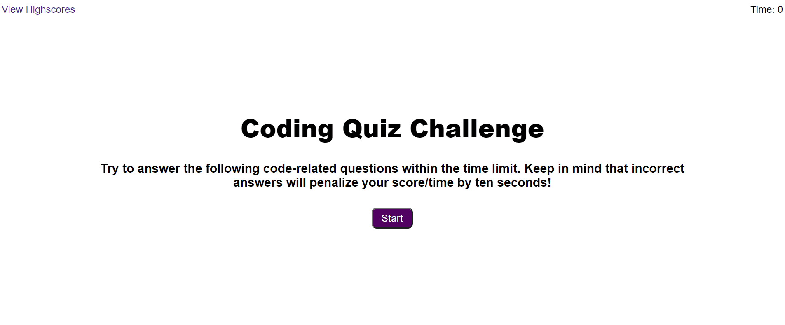

# Password Generator

  

     
    <h2 align="center"><a href="https://github.com/cdfoye/Coding-Quiz"><strong>Link to the GitHub Repo »</strong></a></h2>
     
    <h2 align="center"><a href=" https://cdfoye.github.io/Coding-Quiz/">Link to the Quiz »</strong></a></h2>
     
     
  

<!-- PROJECT DESCRIPTION -->
<h1 align="center"> Project Description</h1>

This project creates a Coding Quiz conisting of 5 code-related questions worth 10 points each. The player will have 75 seconds to complete the quiz. If they get a wrong answer, then a penalty of 10 seconds are deducted from the time as well as 10 points from the player's score. At the end of the quiz, the player will submit their initials, and be taken to the highscores page where they can view their score and see whom of their peers has the highest ranking score.

 
 

<!-- ABOUT THE PROJECT -->
<h1 align="center"> About The Project</h1>

The following is a gif of the quiz's appearance and functionality:

 

